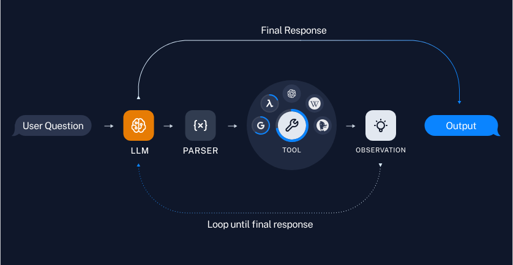

# Supercharge Your Bots with LangChain Tools and Agents. 🦜🤖

🤔# What are LangChain Tools afterall?

Tools serve as interfaces using which agents, chains, or LLMs can engage with the environment. 
This of it as - they are much like how we humans would use any tool to perform our task rather than doing it ourselves.

I could very well calculate what 34x67 is. But I would prefer to use a calculator for it rather.
As the complexity of out AI softwares increases - we would want them to be able to interact with the world in meaningful ways.

If you ask me - they represent a huge step towards more "intelligent" 😜 and autonomous AI apps.


**LangChain Tools:**
- LangChain tools are interfaces that allow an LLM, chain or an agent to interact with external service or data.
- They consist of a tool name, a brief description, a JSON input schema and details of function call. Having a clear visibility essential tool details is crutial for the accuracy of the tool. Note that these components are adjustable if required when the LLM struggles to grasp the tool's usage.
- Tools are usually designed to be simple for often requiring only a single string input.
- They enable LLMs to perform actions like web code analysis, web searches, accessing databases etc.

**LangChain Agents:**
- LangChain agents use an LLM to determine a sequence of actions to take. This is quite different from Chains where the sequence is hardcoded.
- Agents dynamically take decision on the tool usage based on the context of the interaction.
- You can think of them as engines that can plan complex tasks then execute them by leveraging the tools we discussed above.


# Default Tools

LangChain prodices an exhaustive list of pre-defined tools here:

https://python.langchain.com/docs/integrations/tools/


# There are two main ways to use tools: 
## chains and agents

# 🔗Chains lets you create a pre-defined sequence of tool usage(s).


# 👨🏻‍💼Agents let the model use tools in a loop, so that it can decide how many times to use tools.

When a tool is required a fixed number of times, we can create a chain for doing so. But in most cases I would rather avoid this method and instead use tools with Agents as I am going to describe lates.

Refer to code in file

[Tools with Chain Notebook](tools-with-Chain.ipynb)




# Process of using the tools in Agents

This is the method which I would rather prefer.

There are essentially 2 types of tools that we could use 

1. Pre-defined built in tools
2. Custom tools

# There are 3 examples that I would show you in this tutorial:

## 1. Using pre built tools
Here I have taken an example of using a predefines tool called "Google Finance".

## 2. Using custom tools
This example covers how you could define your own custom tools and use them in your agents.

## 3. Using Multiple tools in a single Agent
This example gives out the details on how to utilize multiple tools in a single LangChain Agent and let it decide on it's own as to which toold needs to be utilised.


# ... 🤸‍♂️So Let's Dive in into the implementation of each of these methods

## 1. Using pre built tools (Implementation)
This notebook goes over how to use the Google Finance Tool to get information from the Google Finance page.
You could take a look at the tool's description here:
https://python.langchain.com/docs/integrations/tools/google_finance/

[Tools with built-in Agents - Google Finance](Google-Finance.ipynb)

### Implementation Details:

1. Import the necessary modules `os` and `load_dotenv` from the `dotenv` package. 
`dotenv` is used for loading environment variables from a `.env` file into `os.environ`.

```python
import os
from dotenv import load_dotenv
load_dotenv()
```

2. Import specific tools related to Google Finance from the LangChain library.

```python
from langchain_community.tools.google_finance import GoogleFinanceQueryRun
from langchain_community.utilities.google_finance import GoogleFinanceAPIWrapper
```

3. Set the environment variable `SERPAPI_API_KEY` with a specific API key required for the script's operation.

```python
os.environ["SERPAPI_API_KEY"] = "9c8a52341059sssefaf9434cbff328e78ea1vv576365469vxebf04e973a32337b"
```

4. Create an instance of `GoogleFinanceQueryRun`, which is a tool for querying stock data using Google Finance API.

```python
GoogleFinanceTool = GoogleFinanceQueryRun(api_wrapper=GoogleFinanceAPIWrapper())
```

5. Execute a method `run` of an object named `tool`, likely meant to be `GoogleFinanceTool`, with the argument `"Google"`. However, `tool` is not defined in the provided code.

```python
tool.run("Google")
```

6. Create a list `tools` containing the `GoogleFinanceTool`.

```python
tools=[GoogleFinanceTool]
```

7. Import the `ChatOpenAI` class from the LangChain library and creates an instance `llm` with specific parameters such as model and temperature.

```python
from langchain_openai import ChatOpenAI

llm = ChatOpenAI(model="gpt-3.5-turbo-0125", temperature=0)
```

8. Import `hub` from LangChain and pulls a prompt from a specific repository. The prompt is stored in the variable `prompt`.

```python
from langchain import hub
# Get the prompt to use - you can modify this!
prompt = hub.pull("hwchase17/openai-functions-agent")
prompt.messages
```

9. Import `create_openai_tools_agent` from LangChain and creates an agent using parameters such as `llm`, `tools`, and `prompt`.

```python
from langchain.agents import create_openai_tools_agent
agent=create_openai_tools_agent(llm,tools,prompt)
```

10. Import `AgentExecutor` from LangChain and creates an instance `agent_executor` with specified parameters.

```python
from langchain.agents import AgentExecutor
agent_executor=AgentExecutor(agent=agent,tools=tools,verbose=True)
agent_executor
```

11. Invoke the `invoke` method of `agent_executor` with a dictionary containing an input query. The agent is likely meant to interact with this query, but the functionality depends on the implementation of the agent and associated tools.


```python
agent_executor.invoke({"input":"Tell me stock price history of Meta"})
```


## 2. Using custom tools (Implementation)

This notebook explains the method that you could use to define your own custom tools using LangChain decorators and use them in your agents.

Here is the link to the notebook containing the code.

[Agent With Custom tools](tools-with-custom-Agents.ipynb)


1. Import the required Libraries:
This imports necessary modules from the Language Chain library for creating agents and tool calling agents.

```Python
from langchain import hub
from langchain.agents import AgentExecutor, create_tool_calling_agent
```

2. Fetch Prompt:

Fetche a prompt to use for interacting with the chat model. The prompt should include variables "agent_scratchpad" and "input".

```Python
prompt = hub.pull("hwchase17/openai-tools-agent")
prompt.pretty_print()
```

3. Define the Tools:

Custom tools are defined using decorators provided by the langchain-core module. These tools perform basic mathematical operations such as addition, multiplication, and exponentiation.

```Python
@tool
def add(first_int: int, second_int: int) -> int:
    "Add two integers."
    return first_int + second_int

@tool
def multiply(first_int: int, second_int: int) -> int:
    """Multiply two integers together."""
    return first_int * second_int

@tool
def exponentiate(base: int, exponent: int) -> int:
    "Exponentiate the base to the exponent power."
    return base**exponent

tools = [multiply, add, exponentiate]

```

4. Initialize the Chat Model:

This initializes an instance of the OpenAI Chat model.


```Python
llm = ChatOpenAI(model="gpt-3.5-turbo-0125")
```

5. Create the Agent:


This constructs a tool calling agent by passing in the chat model, defined tools, and the prompt.

```Python
agent = create_tool_calling_agent(llm, tools, prompt)
```

6. Create Agent Executor:

This creates an agent executor by passing in the agent and tools. The verbose=True parameter enables verbose output during execution.

```Python
agent_executor = AgentExecutor(agent=agent, tools=tools, verbose=True)
```


7. Invoke the Agent:

Finally, invoke the agent by passing in an input statement. The agent executes the necessary operations based on the provided input using the defined tools.


```Python
agent_executor.invoke(
    {
        "input": "Take 3 to the fifth power and multiply that by the sum of twelve and three, then square the whole result"
    }
)
```


## 3. Using multiple tools (Implementation)

This documentation provides detailed information about the Python code provided for various tools and utilities in the Langchain Community ecosystem. The code snippets provided here demonstrate how to use these tools to perform various tasks, such as querying Wikipedia, accessing Arxiv papers, and interacting with an OpenAI model for generating responses.

Here is the link to the notebook containing the code.
[Agent With Multiple tools](Agent-with-multiple-tools.ipynb)

### Installation
Before using LangChain, make sure to install it along with its dependencies:

```Python
pip install langchain-community langchain-openai langchain-text-splitters
pip install faiss-cpu # Required for FAISS

```

### Usage

The provided Python code snippets demonstrate the usage of various tools and utilities within the Langchain Community ecosystem. Each code snippet corresponds to a specific task, such as querying Wikipedia, accessing Arxiv papers, or interacting with an OpenAI model.

#### Architecture


1. Environment Setup

### Setting up the tools

```Python
import os
from dotenv import load_dotenv
load_dotenv()

```

2. Wikipedia Query Tool Setup

Set up a tool for querying Wikipedia.

```Python
from langchain_community.tools import WikipediaQueryRun
from langchain_community.utilities import WikipediaAPIWrapper

api_wrapper = WikipediaAPIWrapper(top_k_results=1, doc_content_chars_max=200)
wiki = WikipediaQueryRun(api_wrapper=api_wrapper)

```

3. Document Retrieval Tool Setup

Set up a document retrieval tool using FAISS.

```Python
from langchain_community.document_loaders import WebBaseLoader
from langchain_community.vectorstores import FAISS
from langchain_openai import OpenAIEmbeddings
from langchain_text_splitters import RecursiveCharacterTextSplitter

loader = WebBaseLoader("https://docs.smith.langchain.com/")
docs = loader.load()
documents = RecursiveCharacterTextSplitter(chunk_size=1000, chunk_overlap=200).split_documents(docs)
vectordb = FAISS.from_documents(documents, OpenAIEmbeddings())
retriever = vectordb.as_retriever()

```

4. Arxiv Query Tool Setup

Set up a tool for querying Arxiv.
```Python
from langchain_community.utilities import ArxivAPIWrapper
from langchain_community.tools import ArxivQueryRun

arxiv_wrapper = ArxivAPIWrapper(top_k_results=1, doc_content_chars_max=200)
arxiv = ArxivQueryRun(api_wrapper=arxiv_wrapper)

```

### Chat Model, Prompt and Agent Setup

5. Chat Model Initialisation

Initialize the OpenAI Chat model.

```Python
from langchain_openai import ChatOpenAI

llm = ChatOpenAI(model="gpt-3.5-turbo-0125", temperature=0)

```

6. Prompt Setup

fetch the prompt for the chat model to use.

```Python
from langchain import hub
prompt = hub.pull("hwchase17/openai-functions-agent")

```

7. Agent Creation

create an agent capable of using the defined tools.

```Python
from langchain.agents import create_openai_tools_agent
agent = create_openai_tools_agent(llm, tools, prompt)

```

8. Agent Executor Setup

Set up an agent executor for invoking the agent.

```Python
from langchain.agents import AgentExecutor
agent_executor = AgentExecutor(agent=agent, tools=tools, verbose=True)

```

### Invoking the agent in various ways:

#### Agent Invokation with Retrieval tool over LangChain's documnetation using RAG architecture

```Python
agent_executor.invoke({"input": "Tell me about Langsmith"})

```

##### Output


#### Agent Invokation with Arxiv Tool


```Python
agent_executor.invoke({"input":"What's the paper 1605.08386 about?"})

```

##### Output


#### Agent Invokation with Wikipedia Tool


```Python
agent_executor.invoke({"input":"Tell me about Elon Musk"})

```

##### Output


The Agent Executor module allows you to execute agents that interact with various tools and utilities in the Langchain Community ecosystem.

# Here is the end to end Flow


The Python program presented here showcases the seamless integration of various tools and utilities from the Langchain Community ecosystem. By orchestrating these components, users can achieve complex tasks with relative ease, such as querying information from Wikipedia, accessing Arxiv papers, and interacting with an OpenAI model for generating responses. The program's modularity allows for flexibility and scalability, enabling developers to extend its functionality or integrate additional tools as needed. Overall, this program demonstrates the power and versatility of the Langchain Community ecosystem in addressing diverse needs within the realm of natural language processing and information retrieval.

# Conclusion

So we saw how - LangChain offers a versatile framework for integrating tools into conversational agents, enabling diverse functionalities and use cases. By orchestrating tools within agents, developers can seamlessly integrate multiple functionalities, customize agents to specific needs, and create engaging user experiences across various domains. This flexibility, coupled with the extensibility of LangChain, empowers developers to build intelligent agents that enhance user interactions and streamline tasks, making conversations more productive and engaging.
