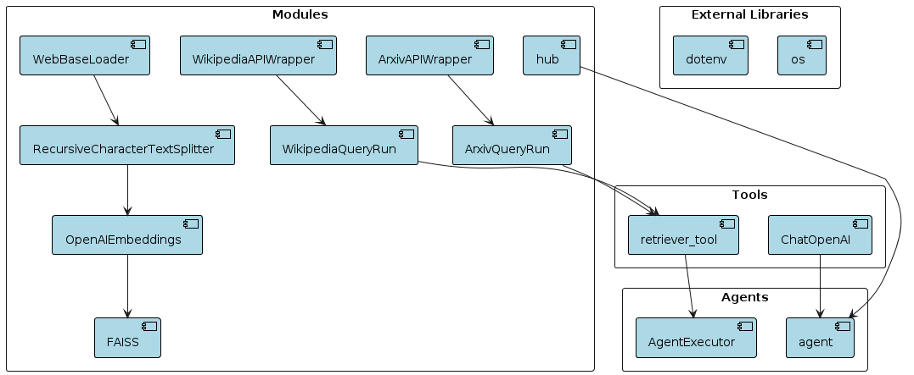
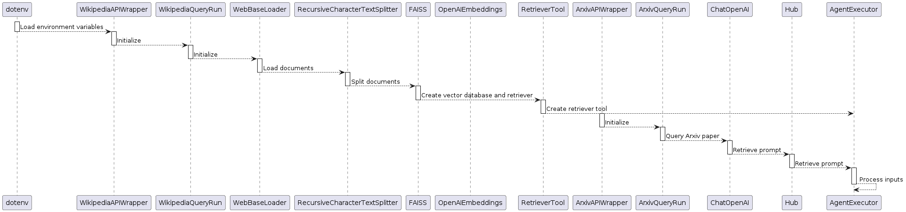

# Langchain Community Documentation

## Overview

This documentation provides detailed information about the Python code provided for various tools and utilities in the Langchain Community ecosystem. The code snippets provided here demonstrate how to use these tools to perform various tasks, such as querying Wikipedia, accessing Arxiv papers, and interacting with an OpenAI model for generating responses.


# Architecture


## Table of Contents

1. [Installation](#installation)
2. [Usage](#usage)
3. [Tools and Utilities](#tools-and-utilities)
    - [Wikipedia Query Tool](#wikipedia-query-tool)
    - [Arxiv Query Tool](#arxiv-query-tool)
    - [Retriever Tool](#retriever-tool)
4. [Agents](#agents)
5. [Agent Executor](#agent-executor)

## Installation

Before using the code provided in this documentation, make sure you have Python installed on your system. You'll also need to install the required packages listed in the `requirements.txt` file.

To install the required packages, run the following command:

```bash
pip install -r requirements.txt
```

# Usage

The provided Python code snippets demonstrate the usage of various tools and utilities within the Langchain Community ecosystem. Each code snippet corresponds to a specific task, such as querying Wikipedia, accessing Arxiv papers, or interacting with an OpenAI model.


# Tools and Utilities

## Wikipedia Query Tool

```Python
import os
from dotenv import load_dotenv
from langchain_community.tools import WikipediaQueryRun
from langchain_community.utilities import WikipediaAPIWrapper

load_dotenv()

api_wrapper = WikipediaAPIWrapper(top_k_results=1, doc_content_chars_max=200)
wiki = WikipediaQueryRun(api_wrapper=api_wrapper)
```

The Wikipedia Query Tool allows you to query Wikipedia for information using the Langchain Community ecosystem.


## Arxiv Query Tool

```Python
from langchain_community.utilities import ArxivAPIWrapper
from langchain_community.tools import ArxivQueryRun

arxiv_wrapper = ArxivAPIWrapper(top_k_results=1, doc_content_chars_max=200)
arxiv = ArxivQueryRun(api_wrapper=arxiv_wrapper)

```

The Arxiv Query Tool enables you to access Arxiv papers using the Langchain Community ecosystem.


## Retriever Tool

```Python
from langchain_community.document_loaders import WebBaseLoader
from langchain_community.vectorstores import FAISS
from langchain_openai import OpenAIEmbeddings
from langchain_text_splitters import RecursiveCharacterTextSplitter
from langchain.tools.retriever import create_retriever_tool

loader = WebBaseLoader("https://docs.smith.langchain.com/")
docs = loader.load()
documents = RecursiveCharacterTextSplitter(chunk_size=1000, chunk_overlap=200).split_documents(docs)
vectordb = FAISS.from_documents(documents, OpenAIEmbeddings())
retriever = vectordb.as_retriever()

retriever_tool = create_retriever_tool(retriever, "langsmith_search", "Search for information about LangSmith.")

```
The Retriever Tool allows you to search for information within a corpus of documents using the Langchain Community ecosystem.


## Agents

```Python
from langchain_openai import ChatOpenAI
from langchain import hub

llm = ChatOpenAI(model="gpt-3.5-turbo-0125", temperature=0)

# Get the prompt to use - you can modify this!
prompt = hub.pull("hwchase17/openai-functions-agent")
prompt.messages
```
The Agents module provides functionality for creating agents that interact with various tools and utilities in the Langchain Community ecosystem.

## Agent Executor


```Python
from langchain.agents import create_openai_tools_agent, AgentExecutor

tools = [wiki, arxiv, retriever_tool]

agent = create_openai_tools_agent(llm, tools, prompt)

agent_executor = AgentExecutor(agent=agent, tools=tools, verbose=True)

# Example invocations
agent_executor.invoke({"input": "Tell me about Langsmith"})
agent_executor.invoke({"input": "What's the paper 1605.08386 about?"})
agent_executor.invoke({"input": "Tell me about Elon Musk"})

```

The Agent Executor module allows you to execute agents that interact with various tools and utilities in the Langchain Community ecosystem.

# Here is the end to end Flow



# Conclusion and Learnings

The Python program presented here showcases the seamless integration of various tools and utilities from the Langchain Community ecosystem. By orchestrating these components, users can achieve complex tasks with relative ease, such as querying information from Wikipedia, accessing Arxiv papers, and interacting with an OpenAI model for generating responses. The program's modularity allows for flexibility and scalability, enabling developers to extend its functionality or integrate additional tools as needed. Overall, this program demonstrates the power and versatility of the Langchain Community ecosystem in addressing diverse needs within the realm of natural language processing and information retrieval.

